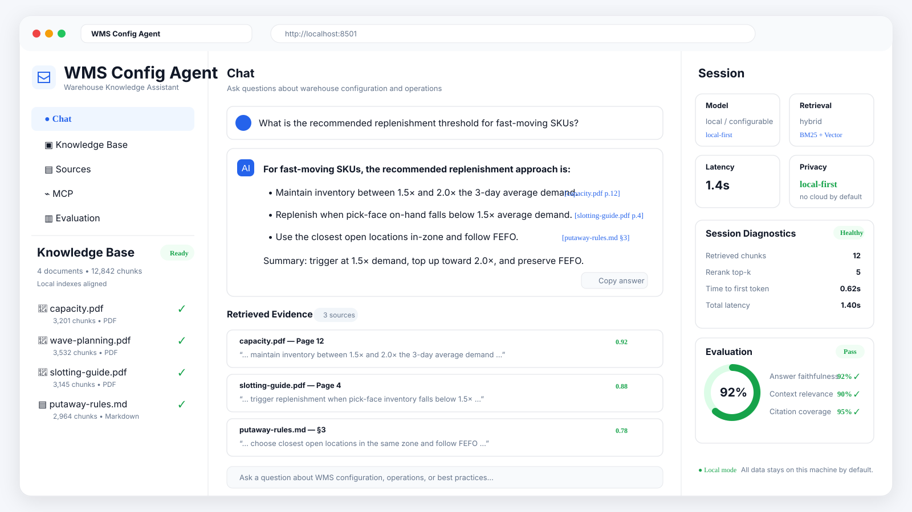

# WMS Config Agent

**Ask questions about WMS / JDA configuration documentation and get answers backed by source citations.**

A local-first, citation-first knowledge assistant for warehouse-management and enterprise configuration documentation.

> **Private by default. No cloud required for the default workflow. If the evidence is not strong enough, the agent refuses instead of inventing an answer.**

[](https://www.python.org/)
[](LICENSE)
[](#how-it-works)
[](#mcp-server)
[](#privacy-and-safety)

## See it in action



*Illustrative dashboard preview: ask a warehouse configuration question and get a grounded answer with citations, retrieved evidence, local-first diagnostics, and evaluation metrics.*

## Why WMS Config Agent?

Warehouse configuration knowledge is often buried across hundreds or thousands of pages of manuals, implementation notes, operating procedures, and internal documentation.

Traditional search can find keywords, but it does not reliably answer questions such as:

> How should replenishment be configured for fast-moving SKUs?
>
> Which putaway rule applies to this storage profile?
>
> Where is this configuration behavior documented?

WMS Config Agent combines **vector retrieval + BM25 search + reciprocal-rank fusion** to retrieve relevant evidence and return answers tied back to their original sources.

The goal is not simply to generate an answer. The goal is to generate an answer you can **verify**.

## What you get

- **Citation-first answers** — retrieval results carry source/page evidence instead of unsupported instructions.
- **Hybrid search** — BM25 and Chroma vector retrieval are aligned and fused with reciprocal-rank fusion.
- **Local-first defaults** — the default ingestion/query path does not require an API key.
- **Evidence-aware refusal** — insufficient evidence results in a refusal rather than unsupported instructions.
- **Read-only MCP tools** — expose WMS knowledge safely to MCP-compatible desktop hosts.
- **Six-page Streamlit dashboard** — inspect data, ingestion traces, query diagnostics, lifecycle operations, and evaluation.
- **Deterministic evaluation** — run a committed public benchmark without private documents.
- **Privacy and safety controls** — local artifacts stay out of Git and risky lifecycle operations require explicit confirmation.
- **Enterprise RAG reference architecture** — adapt the same architecture beyond WMS documentation.

## How it works

```text
Authorized documents
        |
        v
Ingestion & chunking
        |
        +--> BM25 lexical index
        |
        +--> Chroma vector index
                 |
                 v
        Reciprocal Rank Fusion
                 |
                 v
          Evidence + citations
                 |
          +------+------+
          |             |
          v             v
      MCP tools      Dashboard
```

The result is a practical reference implementation for **private enterprise RAG + MCP**, using WMS/JDA documentation as the primary vertical use case.

## Use it beyond WMS

Although the project started as a WMS / JDA configuration assistant, the architecture is intentionally reusable. You can fork it and adapt the same pipeline for:

- ERP configuration documentation
- SAP implementation manuals
- internal SOPs and work instructions
- compliance and policy documentation
- network or infrastructure runbooks
- product and engineering documentation
- enterprise knowledge assistants

## Quick start

### Requirements

- Git
- Python 3.12

Commands below use PowerShell on Windows. On Linux/macOS, use the equivalent `.venv/bin/python` executable.

```powershell
git clone https://github.com/lucas-llu/wms-config-agent.git
cd wms-config-agent
python -m venv .venv
.\.venv\Scripts\python.exe -m pip install --upgrade pip
.\.venv\Scripts\python.exe -m pip install -e ".[dev]"
.\.venv\Scripts\python.exe main.py
```

Expected final line:

```text
wms-config-agent is ready (development).
```

To reproduce the committed, fully sanitized release workflow without private documents:

```powershell
.\.venv\Scripts\python.exe -m pytest tests/e2e/test_recall_benchmark.py `
  tests/e2e/test_dashboard_day9_workflow.py `
  tests/integration/test_mcp_server_e2e.py -q
```

## Ingest a document

Only ingest documents you are authorized to use.

```powershell
.\.venv\Scripts\python.exe scripts\ingest.py `
  --path C:\authorized\sanitized-manual.pdf `
  --collection sanitized-demo
```

Re-running an unchanged document is skipped. Add `--force` only when a deliberate rebuild is required.

To index existing processed JSONL chunks instead, omit `--path` or pass `--chunks PATH`.

## Query the knowledge base

```powershell
.\.venv\Scripts\python.exe scripts\query.py `
  --query "SWL.I.11.04 putaway configuration" `
  --collection sanitized-demo `
  --verbose
```

Useful filters include:

- `--domain`
- `--document-type`
- `--process-code`
- `--json`

See [docs/CORPUS_PROCESSING.md](docs/CORPUS_PROCESSING.md) and [docs/QUERYING.md](docs/QUERYING.md) for retrieval details.

## MCP server

After both indexes exist, start the newline-delimited JSON-RPC stdio server:

```powershell
.\.venv\Scripts\python.exe scripts\start_mcp_server.py
```

The server exposes three read-only tools:

- `query_wms_knowledge` — returns evidence excerpts with source/page citations.
- `list_wms_collections` — returns privacy-safe corpus counts.
- `get_wms_document_summary` — returns an extractive document summary.

Desktop MCP hosts should use absolute paths for the Python executable, script, settings, BM25 index, and processed chunks.

See [docs/MCP_SERVER.md](docs/MCP_SERVER.md) for host configuration and protocol details.

## Dashboard

Start the local-only dashboard:

```powershell
.\.venv\Scripts\python.exe scripts\start_dashboard.py
```

The dashboard binds to `127.0.0.1` and includes pages for:

- system overview and health
- read-only data browsing
- bounded PDF ingestion
- confirmation-gated cleanup
- ingestion traces
- query diagnostics
- benchmark evaluation

The Evaluation page only permits the dataset explicitly named by `evaluation.golden_test_set`. Its history stores aggregate metrics and failed case IDs, not query or document text.

## Evaluation

The committed public dataset is:

```text
tests/fixtures/golden_test_set.json
```

Run the self-contained public benchmark:

```powershell
.\.venv\Scripts\python.exe -m pytest tests/e2e/test_recall_benchmark.py -q
```

To evaluate an already indexed compatible corpus and persist a report:

```powershell
.\.venv\Scripts\python.exe scripts\run_benchmark.py `
  --dataset tests\fixtures\golden_test_set.json `
  --output data\evaluation\public-candidate.json `
  --enforce-thresholds
```

Use `--baseline data\evaluation\previous.json --fail-on-regression` only when the baseline has the same dataset fingerprint and case IDs.

See [docs/BENCHMARK_V1.md](docs/BENCHMARK_V1.md).

## Settings and local data

Typed configuration lives in [config/settings.yaml](config/settings.yaml).

Defaults use:

- local LSA embeddings
- Chroma
- BM25
- reciprocal-rank fusion
- no reranker
- deterministic threshold evaluation
- disabled Vision processing
- `use_llm: false` for text transforms

No API key is needed for the default ingestion/query path.

| Purpose | Default | Environment override |
|---|---|---|
| Settings | `config/settings.yaml` | `WMS_CONFIG_PATH` |
| BM25 index | `data/db/bm25` | `WMS_BM25_PATH` |
| Ingestion history | `data/db/ingestion_history.db` | `WMS_INGESTION_HISTORY_PATH` |
| Dashboard staging | `data/staging` | `WMS_STAGING_PATH` |
| Processed artifacts | `data/corpus/processed` | `WMS_PROCESSED_PATH` |
| Dashboard evaluation history | `data/evaluation/dashboard` | `WMS_EVALUATION_REPORT_ROOT` |
| Dashboard upload limit | 25 MiB | `WMS_DASHBOARD_MAX_UPLOAD_MB` |

If you explicitly enable an OpenAI-compatible text transform, set the variable named by `llm.api_key_env` (currently `WMS_LLM_API_KEY`). Read [docs/LLM_PROVIDER.md](docs/LLM_PROVIDER.md) before enabling network-backed processing.

All paths under `data/`, plus models, indexes, traces, authorized PDFs, and private benchmark reports, are local artifacts and ignored by Git.

## Quality gates

Run the same core checks used by public CI:

```powershell
.\.venv\Scripts\python.exe -m ruff check src tests scripts main.py
.\.venv\Scripts\python.exe -m ruff format --check src tests scripts main.py
.\.venv\Scripts\python.exe -m pytest `
  --cov=src --cov-report=term-missing --cov-fail-under=90
```

The live LLM acceptance test is skipped unless `WMS_LLM_INTEGRATION=1` is explicitly set.

GitHub Actions additionally scans the event, complete Git history, and working tree with Gitleaks, then runs the committed public benchmark gate.

## Privacy and safety

- Never commit authorized/private PDFs, processed text, indexes, model caches, traces, `.env` files, secrets, or private evaluation reports.
- Query traces contain the user's query and inferred filters; protect the local `logs/` directory.
- MCP structured citations remove absolute host paths.
- Dashboard trace readers remove known credential/body fields and bound the amount of history read.
- Dashboard PDF uploads enforce a size limit, stage atomically, and require an explicit collection.
- Deletion requires the exact displayed confirmation phrase and coordinates cleanup across Chroma, BM25, images, history, and allowlisted artifacts.
- The product is local and single-user. It has no production WMS write path, network auth, or multi-tenant isolation.

## Project status

Days 1–10 are implemented on `develop`:

- offline ingestion
- hybrid retrieval
- cited MCP delivery
- document enrichment
- lifecycle hardening
- six-page operations/trace dashboard
- deterministic evaluation UI
- contract coverage
- sanitized release acceptance

Deferred provider work currently includes:

- Ollama / hosted embeddings
- cross-encoder or LLM rerankers
- Azure Vision
- Ragas

See [docs/DEVELOPMENT_PLAN.md](docs/DEVELOPMENT_PLAN.md) for the detailed delivery record.

## Troubleshooting

- **`No retrieval index found`** — ingest an authorized PDF or compatible processed chunks first; both Chroma and BM25 must be non-empty and aligned.
- **Local LSA model mismatch** — after changing corpus, embedding dimensions/model, or chunking, rebuild both indexes together.
- **Lifecycle lock timeout** — stop another ingestion/cleanup process and retry. Do not delete a live lock based only on file age.
- **Windows sharing violation** — close processes holding model/index files and retry.
- **Chroma compatibility error** — install the pinned `chromadb>=1.5,<1.6` range from this project.
- **Dashboard cannot load** — check `WMS_CONFIG_PATH` and local storage overrides. Use `scripts/verify_dashboard_readonly.py` to verify management reads against an existing store.
- **Live provider test skipped** — expected for offline development. Enable it only after reading the provider/privacy instructions and setting the required key.

## Contributing

Issues, experiments, documentation improvements, retrieval ideas, MCP integrations, and domain adaptations are welcome. See [CONTRIBUTING.md](CONTRIBUTING.md) for setup and contribution guidelines.

Good contribution areas include:

- additional retrieval/reranking strategies
- generic-domain examples
- MCP host integrations
- evaluation tooling
- documentation and onboarding improvements
- privacy/security hardening

If you adapt the project to a different enterprise documentation domain, consider opening an issue or PR describing what changed and what was reusable.

## License

MIT License. See [LICENSE](LICENSE).

---

If this project is useful to you, consider giving it a ⭐ — it helps other developers working on private enterprise RAG, MCP, and WMS tooling discover the project.
