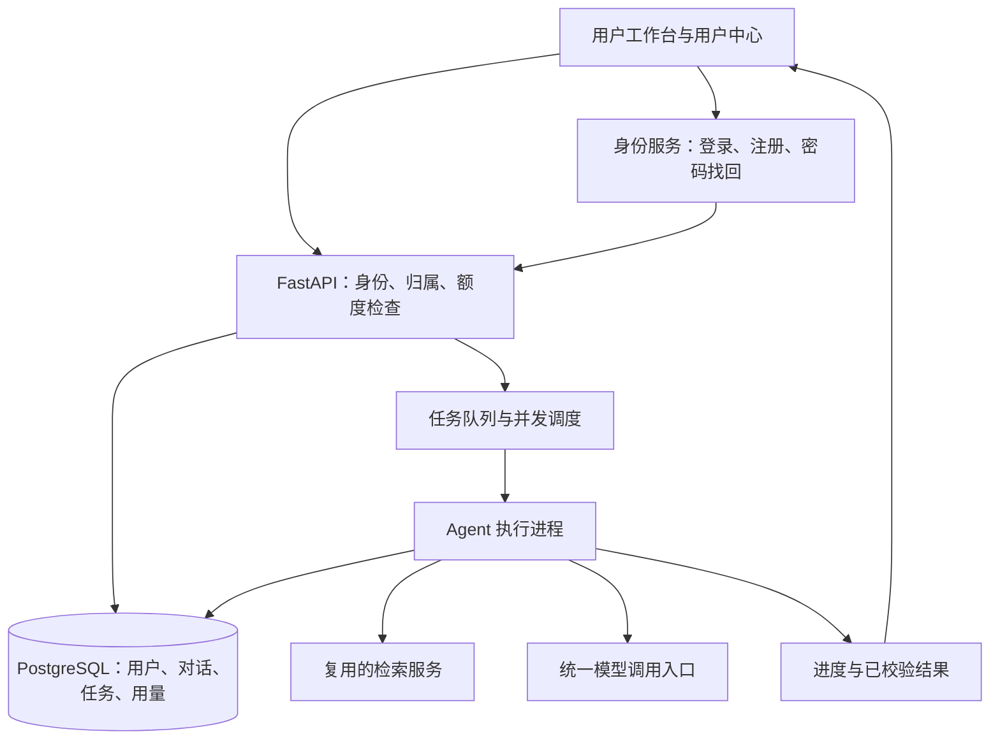

# 用户中心、对话隔离与并发优化开发计划

日期：2026-10-05。状态：总体开发计划；P0 原型和设计确认见 [MULTIUSER_P0_DESIGN.md](MULTIUSER_P0_DESIGN.md)。
P1 身份与归属隔离的增量实现及实测结果见 [MULTIUSER_P1_ISOLATION.md](MULTIUSER_P1_ISOLATION.md)。
P2 用户中心与 React 工作台及退出门禁见 [MULTIUSER_P2_WORKBENCH.md](MULTIUSER_P2_WORKBENCH.md)。
历史用户数据迁移、公开注册和生产并发尚未实施；工期为工作量估计，不是上线承诺。

## 1. 目标与首版边界

将现有本地 WMS Agent 改造为可供多名用户独立使用的应用，保留已有问答、引用、配置规划和审批能力。
默认继续使用完整片段与一次补查策略；旁路核验仍由用户为单次提问主动选择。

首版按小团队使用设计，先验证 10 个用户同时提交对话，再以 20 个并发用户做压力摸底。
这里的并发用户是同时发起请求的人数，不是允许同时调用模型的数量；模型实际并发必须根据供应商限额配置。
默认支持邮箱注册和验证；可配置邀请码。新账号不自动继承现有知识库权限。

| 模块 | 首版功能 | 验收要点 |
|---|---|---|
| 账号 | 注册、验证邮箱、登录、退出、忘记密码、重置/修改密码 | 邮箱流程可用；重置链接过期和重复使用失败；账号不存在时不泄露注册情况 |
| 用户中心 | 昵称、邮箱、账号状态、登录设备/会话、退出其他设备 | 账号停用、退出及密码重置后的会话失效行为可验证 |
| 我的对话 | 新建、搜索、重命名、归档、删除、恢复、导出 | 只操作自己的对话，刷新/重新登录后仍可恢复 |
| 用量 | 今日/本月请求量、输入/输出 token、剩余额度、估算费用、明细 | 可按对话、模型、默认/旁路策略查看；失败和取消的已知消耗不遗漏 |
| 对话体验 | 排队、检索、生成、核验状态；取消请求；断线后恢复查看 | 页面刷新不重复执行，重连不重新扣额度 |
| 管理功能 | 用户启停、Workspace 成员、知识库授权、额度、聚合用量、运行健康 | 普通用户无法访问管理接口；管理员默认不能浏览私人聊天正文 |

首版不包含在线支付、充值、套餐订阅、公开分享聊天、多人共同编辑同一对话和企业 SSO 多供应商接入。
这些功能不是当前需求的前置条件。账号系统采用 OIDC，给以后接企业身份系统保留接口。

## 2. 建议架构与现有代码复用

建议用户端采用 React + TypeScript，业务接口采用 FastAPI，继续调用现有 Python Agent/RAG 服务。
现有 Streamlit 在迁移期间保留，之后作为受限运维界面；新用户端沿用已有工作台布局和交互。
前端重建是产品交互选择，并不是并发性能的来源。性能主要来自资源复用、后台执行和全局调度。

建议组件分工：

- **Keycloak / OIDC 身份服务**：负责密码、注册验证、重置邮件及身份会话，应用只保存身份映射和业务资料。
  首版使用统一样式的身份服务页面完成登录/注册/找回密码；应用自己的用户中心承载用量和对话管理。
  Keycloak 已提供这些身份流程及会话管理能力，具体策略仍需配置和集成测试。
  [官方管理文档](https://www.keycloak.org/docs/latest/server_admin/index.html)
- **FastAPI**：统一认证与资源授权入口，页面和 MCP 适配器都调用相同的业务服务。
- **PostgreSQL**：业务会话、用户、运行任务和用量的事实来源；检查点使用兼容的 PostgreSQL 持久化适配器，
  与业务表分 schema 管理。迁移前先验证当前 LangGraph 版本的兼容性。
- **Redis + 成熟任务队列组件**：调度、事件通知、分布式限流；具体队列库在第一阶段通过恢复测试后锁定。
  对话、用量及任务终态不只保存在 Redis 中。
- **后台 Agent 执行进程**：复用现有 Supervisor、知识检索、引用校验和两条回答策略。
- **检索资源**：首版保留现有索引，集中复用模型与连接；先用独立检索服务管理本地索引生命周期，
  不让多个进程各自重新加载和随意修改同一索引目录。

Streamlit 自带 OIDC 登录能力，但身份认证并不自动提供业务授权；即便暂时保留 Streamlit 前端，
下述后端归属检查也必须实施。[Streamlit 官方说明](https://docs.streamlit.io/develop/concepts/connections/authentication)

## 3. 数据模型与用户隔离

| 数据 | 关键字段或关系 | 规则 |
|---|---|---|
| users | id、identity_issuer、identity_subject、email、status | 用 issuer + subject 识别账号，邮箱不作为永久身份主键 |
| workspace_memberships | user_id、workspace_id、role | 控制可使用的业务知识范围，不自动赋予查看其他成员聊天的权限 |
| conversations | id、owner_user_id、workspace_id、revision、deleted_at | 对话拥有者不可通过普通修改接口替换 |
| turns / revisions / drafts / approvals | conversation_id、run_id | 所有读取及操作沿父对话校验归属；配置审批仍走原有权限和流程 |
| runs | owner_user_id、conversation_id、idempotency_key、status、lease_epoch | 跟踪一个用户请求的排队、执行、取消与终态 |
| model_attempts / usage_events | run_id、attempt_id、provider_request_id、token 分类、usage_source | 逐次记录真实模型调用，累计值从明细聚合 |
| quota_reservations | user_id、run_id、预留额度、最终结算状态 | 并发请求原子预留，防止同时通过额度检查后超用 |
| exports / attachments | conversation_id、storage_key | 下载时重新授权，不通过公开目录暴露文件 |
| audit_events | actor_user_id、action、resource_id、timestamp | 记录登录、改密、停用、额度修改与管理员操作，避免记录密码和令牌 |

隔离必须覆盖：对话列表、消息、历史版本、摘要/记忆、草稿、引用、插图、导出文件、后台任务、进度事件、
检查点、缓存、反馈、用量和日志。知道另一个用户的 conversation_id 或 run_id 不构成访问权限。

实现原则：

1. 后端从认证会话取得当前用户身份。请求正文中的 user_id、owner_user_id、角色不能用来决定授权。
2. 用户请求既要拥有该对话，又要属于相应 Workspace；共享知识库与私人对话分开授权。
3. Repository 接口要求可信用户上下文，不允许普通请求调用不带归属条件的查询。
4. PostgreSQL 行级安全作为第二层防护；业务运行账号不能是表 owner、超级用户或带 BYPASSRLS 的角色。
   数据库连接池复用时，用事务级上下文设置身份，防止上一个用户身份残留。
   [PostgreSQL 行级安全说明](https://www.postgresql.org/docs/current/ddl-rowsecurity.html)
5. 任务从排队转执行时再次确认账号状态、对话归属和 Workspace 权限；账号停用后停止接纳新任务，
   已运行任务的后续工具步骤和结果读取也必须受控。
6. 服务器生成检查点命名空间；请求方不能直接指定任意 thread_id。后台写入使用执行代次，防止过期执行者覆盖。
7. 所有多用户入口统一授权；现有 MCP 的 host_process 身份不能被公开映射为所有用户的权限。
   未接入可信身份的旧入口仅限隔离的本地管理环境。
8. 不同用户不共用聊天答案缓存；检索缓存至少包含权限范围、版本过滤和索引版本。
   私人摘要与记忆必须绑定 user_id + conversation_id。

密码恢复采用有效期有限、单次使用的恢复凭证，并限制提交频率；邮箱不存在与存在时保持一致的对外提示。
配置重置后的会话撤销策略并测试，不能只改密码而让旧登录继续有效。
[OWASP 密码恢复指导](https://cheatsheetseries.owasp.org/cheatsheets/Forgot_Password_Cheat_Sheet.html)

## 4. 并发执行与请求恢复

一条消息的处理顺序：认证 → 归属检查 → 幂等检查 → 原子预留额度 → 创建任务 → 排队 → 获取会话执行权
→ 检索/生成 → 引用校验 → 持久化结果 → 结算用量 → 通知页面。

### 4.1 同一对话串行，不同对话并行

- 同一对话最多有一个活跃运行。首版第二条并发消息返回“该对话正在处理”，不静默与第一条混合。
- 执行权以数据库唯一约束/原子状态更新为最终依据，租约心跳和代次防止进程失联后的旧任务继续提交。
- 不在整个模型请求期间持有数据库事务或数据库连接。
- 不同对话允许并行；首版建议每用户最多 2 个活跃对话、5 个待处理任务，数值全部可配置。
- Worker 数量不等于模型调用额度：检索、模型、旁路核验分别受资源上限控制。

### 4.2 统一模型入口和公平调度

- 所有生成、补查查询生成、旁路核验、摘要和结构修复均经过统一入口。
- 按供应商/模型限制同时在途请求，并结合请求频率和 token 预算管理。
- 每个用户有并发上限和公平轮转；旁路使用单独子额度，同时遵守供应商总额度，避免占满普通问答资源。
- 429、超时和临时错误进入有上限的退避，记录实际 attempt，不能多层重试无意相乘。
- 队列满时明确提示繁忙，提供等待/重试状态；设置排队超时，避免无限堆积。

### 4.3 资源复用

- API 与执行进程启动时初始化可复用服务，避免每条消息重新构建模型客户端、检索对象和嵌入模型。
- HTTP 与 PostgreSQL 使用受限连接池，连接数按全部进程的总量规划。
- 复用资源前明确线程安全和索引更新策略；共享读取对象不同时用于索引写入。
- 向量与关键词检索可以保留并行，但总线程/任务数量受全局上限约束，避免“用户数 × 检索线程数”失控。
- 现有同步调用先放到有上限的执行进程/线程池；仅改成 async 函数名不会解决阻塞。

### 4.4 幂等、取消和断线

- 客户端为一次发送生成幂等键。相同用户、对话及键的重试返回已有 run_id；相同键不同内容拒绝。
- 页面通过 SSE 接收阶段进度和结果；重连按事件序号补读，不重新创建任务。
- 现有生成是引用校验后才可信：可以流式展示排队/检索等状态，未经校验的模型文本不直接作为正式答案展示。
- 取消排队任务后释放未使用额度；运行任务尽可能取消，下一个步骤前检查取消状态，不承诺已发送模型请求零费用。
- 采用持久化任务与事务 outbox 防止“数据库已接收但未成功入队”的丢任务窗口。
- 队列重复投递不能重复提交答案或用量；对供应商超时后是否已执行不明的调用标记待核对，
  不宣称外部模型调用具有严格 exactly-once 保证。

## 5. 用量统计与额度

用量不能直接等同于当前 state.tokens_used。现有计数用于回合预算，有估算兜底，也可能没有失败请求的供应商用量。
新增逐次调用账本，区分供应商实际返回、平台估算、未知/待对账三种来源。

- 记录输入 token、输出 token、缓存命中等供应商提供的分类；推理 token 若属于输出的子集，不再次相加。
- 每次重试分别记录；默认生成、补查、旁路核验、最终修订都归到相应用户、对话和 run。
- 保存当次价格版本、计价币种和模型标识；费用显示“估算”，不冒充供应商账单，也不硬编码未经确认的价格。
- 月额度在请求进入前预留，完成后按实际值结算差额；超时和取消按已知消耗结算，未知部分进入对账。
- 记录时间统一用 UTC；首版用量页面明确按 Asia/Shanghai 展示与划分账期。
- 用户只看自己的明细；管理员看聚合指标。普通额度管理不需要读取聊天正文。

## 6. 开发阶段与交付物

按一名熟悉项目的全栈开发者估计 30–43 个工作日，约 6–9 周。
这是建议架构下的工作量，不包含等待邮件服务、域名/证书、部署资源和供应商扩容审批的时间。
第一阶段确认范围后重新估算，不以压缩隔离测试来换取上线日期。

| 阶段 | 预计工作日 | 交付物 | 退出条件 |
|---|---:|---|---|
| P0：基线与设计冻结 | 2–3 | API/权限矩阵、用户与 Workspace 模型、并发基准、身份服务和队列原型 | 登录到 API 身份传递、队列恢复、检查点适配验证通过；固定版本与迁移设计 |
| P1：后端身份与归属隔离 | 5–7 | OIDC 接入、users/memberships、受限 Repository、行级策略、接口鉴权 | 用户 A 无法通过任何已列入口读取/修改用户 B 的内容 |
| P2：用户中心与新工作台 | 6–8 | 注册/登录/密码恢复入口、资料与设备页、私有对话管理、默认/旁路按钮 | 两个独立浏览器账号完整走通注册到聊天再退出重登；旧工作台能力不倒退 |
| P3：后台任务与并发控制 | 6–9 | 持久任务、幂等、会话执行权、公平队列、连接池、进度与取消 | 重复提交/多标签页/进程重启不串话、不重复提交；排队可见 |
| P4：用量与管理 | 4–6 | 调用账本、原子额度预留、个人用量页、管理员额度与账号管理 | 多请求同时预留不会绕过额度；明细、汇总和重试消耗可对账 |
| P5：迁移、压测与试用 | 7–10 | 迁移/回退脚本、并发报告、故障演练、小范围部署 | 全部隔离与恢复门禁通过，达到首版并发目标，再开放多人使用 |

依赖关系：P0 → P1 → P2/P3 → P4 → P5。P2 和 P3 在有多人投入时可部分交错；
单人实施仍按表估算总工作量。每阶段演示一次可使用的增量。

主要代码改造位置：

- `src/agents/repositories/`：抽取存储接口，新增带用户上下文的 PostgreSQL 实现。
- `src/agents/supervisor.py`、`runtime.py`：运行身份、任务执行权、检查点和恢复。
- `src/agents/services/answer_pipeline.py`：接入共享模型调度与逐次用量，不改变默认/旁路选择语义。
- `src/libs/llm/`：统一调用统计、连接复用、限流与重试边界。
- `src/mcp_server/app.py`、`tools/configuration_sessions.py`：与 HTTP 入口复用受权业务服务。
- 新增 `src/api/`、`src/workers/`、`frontend/`、数据库迁移目录及部署配置。
- 现有 Dashboard 改为受限管理入口；停止从公共页面直接创建拥有主机权限的工具处理器。

## 7. 测试与上线门禁

### 身份及越权

使用 A/B 两个真实登录账号覆盖读取、继续提问、搜索、重命名、删除、恢复、导出、附件下载、
用量查询、运行状态、SSE、历史版本和检查点恢复。修改资源 ID、请求中的 owner_id、Workspace、
Cookie 和旧 token 都不能绕过归属检查。对账号停用、角色撤销、重置密码后旧会话继续访问做测试。

### 并发与故障

- 用可控模型模拟器执行 1/2/5/10/20 用户阶梯负载，分别测试不同对话和同一对话竞争。
- 再按实际供应商额度进行受限真实模型测试，混合默认和旁路策略；模型速度单独计时。
- 覆盖 Worker 被终止、队列重复投递、租约到期、数据库短暂不可用、Redis 重启、模型 429/超时、
  浏览器刷新/断线重连、用户取消、执行途中账号停用。
- 检查跨用户泄露次数为 0、重复结果提交为 0、应用内重复记账为 0；外部执行状态未知必须可追踪。

### 建议首版性能目标

以下是验收目标而非现有能力，P0 固定测试硬件、语料量、模型模拟耗时和队列配置后确认：

| 指标 | 目标 |
|---|---|
| 10 用户同时提交时接收请求/返回 run_id | p95 ≤ 1 秒，排队和模型执行耗时另计 |
| 用户中心、会话列表等普通读取 | p95 ≤ 500 毫秒，在约定数据量与分页条件下 |
| 受控模型下正常负载的服务端错误率 | < 1%，不包括明示的限流、取消或额度不足 |
| 公平性 | 单用户满额提交不能阻止其他用户获得执行机会；记录每用户排队时间 |
| 20 用户过载 | 明确排队或拒绝，不丢任务、不无限增线程/内存；报告吞吐、p95 等待与资源峰值 |

不承诺所有问题几秒内完成：最近真实回放默认回答约 20–121 秒，旁路约 67–133 秒，包含失败回退，
且不能当作 p95。新架构要分开呈现排队、检索、模型、核验与平台开销。

## 8. 现有数据迁移和发布

1. 备份并清点 SQLite 会话、检查点、反馈、导出文件及索引；在副本上试迁移。
2. 每条旧对话由管理员显式指定归属。未能确定归属的历史数据隔离保存，不交给首个注册用户或全员共享。
3. 对照消息/版本/引用/审批记录数量及内容摘要校验迁移；原有批准状态不能因迁移被扩大。
4. 检查点做兼容性验证；不能迁移的旧流程保持只读历史，用户可显式新建会话，不能假装恢复成功。
5. 切换窗口暂停旧环境写入，完成最后增量迁移；新系统开放写入后禁止两个系统同时写同一会话。
6. 先使用独立测试账号和副本验收，再灰度到小团队；观察账号隔离、排队、供应商错误与费用。
7. 回退时先暂停新写入并保存新期间的数据与账本。未完成反向迁移前，新数据保持只读可查；
   不直接启动旧应用覆盖新数据。

实施前需要落实的外部配置：部署主机与域名、HTTPS、发送验证/重置邮件的服务、
身份服务自建或现有企业 OIDC、初始管理员、历史会话归属、供应商并发/RPM/TPM 及计价配置。
这些配置不妨碍先完成 P0 原型与设计；在对外开放注册前必须落实。
